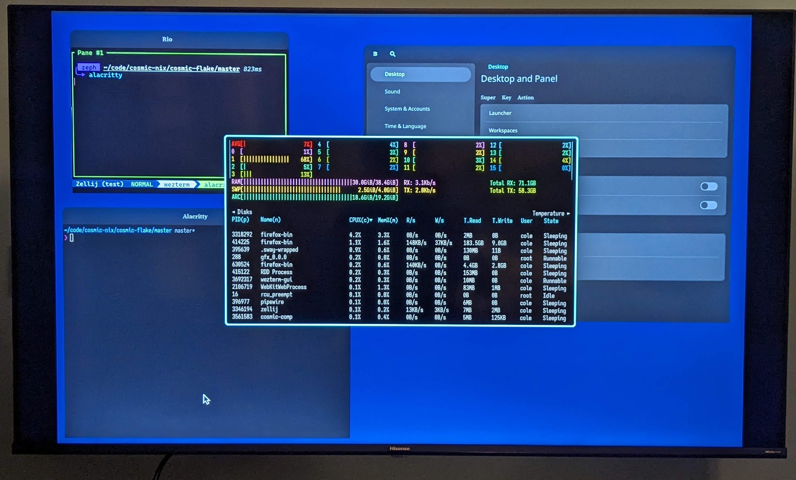

# cosmic-flake

see: [cosmic-nix](https://github.com/cosmic-nix)


(running components manually, on DRM, from TTY)

## usage

- this updates, rebases, update flake inputs for "supported" cosmic components

```shell
# update cosmic components and their flake inputs, then this flake's usage of those
nix develop -c ./main.nu update

# build all working packages
nix build '.#packages.x86_64-linux.all'
ls -al ./result
# total 3
# lrwxrwxrwx 1 root root 59 Jan  1  1970 cosmic-bg -> /nix/store/klxh4ajv29l96xp5rdknb5iqzmh35zdb-cosmic-bg-0.1.0
# lrwxrwxrwx 1 root root 96 Jan  1  1970 cosmic-comp -> /nix/store/zygjm2926wvd3v188c8wjk45zd9hzm77-cosmic-comp-b0286678649c62ff5afb44375bdd7f3228541eb1
# lrwxrwxrwx 1 root root 65 Jan  1  1970 cosmic-launcher -> /nix/store/bnh9y35fy2q7db54sxljxwk9473a2ajr-cosmic-launcher-0.1.0
# lrwxrwxrwx 1 root root 66 Jan  1  1970 cosmic-panel -> /nix/store/3gwb6aylqckn5gk5d085gmlcb1hxnv41-cosmic-panel-bin-0.1.0
# lrwxrwxrwx 1 root root 64 Jan  1  1970 cosmic-session -> /nix/store/kqd3jfv58pbrjqq02j258xakk31yfgym-cosmic-session-0.1.0
# lrwxrwxrwx 1 root root 65 Jan  1  1970 cosmic-settings -> /nix/store/nf09d2rbly67wlvzg65xgh7alvv37vvk-cosmic-settings-0.1.0

# build failing packages
nix build --keep-failed -L '.#packages.x86_64-linux.cosmic-osd'
nix build --keep-failed -L '.#packages.x86_64-linux.xdg-desktop-portal-cosmic'
```

## cache

see: [cachix - `cosmic-nix`](https://app.cachix.org/cache/cosmic-nix)

## investigate
- why does cosmic-panel have an outpath of "cosmic-panel-bin" when others don't have "-bin" suffix?
  - is there drift among how the nix flakes are setup for the components?
  - feels like annoying maintenance long term... :(

## todo
- maybe use `git-repo-manager`
- add CI
- don't rely on my own homedir/code structure

## status:
* not working:
  * xdg-desktop-portal-cosmic
  * cosmic-osd
* building:
  * cosmic-bg
  * cosmic-comp
  * cosmic-panel
  * cosmic-launcher
  * cosmic-session
  * cosmic-settings

## notes:
* all other repos are WIP forks
* the `cosmic-flake` flake currently points at these forks

## credits:
* all credits to the pop-os devs
* and to the indiviudal who added the upstream flakes (TODO: better credit here, username, etc)
